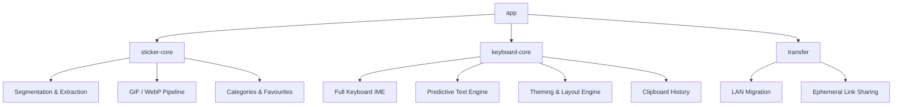

# StickerKeyboard

*(working title — rename this header, the badges, and the applicationId
once an actual name is picked; nothing below depends on the name itself)*


**An iOS-level sticker and keyboard experience for Android — more
customizable than either platform's default, and fully local.**

Create stickers from screenshots or photos, edit them whenever you want
instead of recreating them, turn video clips into GIFs, and use all of it
from a keyboard you can fully re-theme, re-layout, and re-skin — with
accurate predictive text that adapts to you specifically, without a
single byte of it ever leaving your device.

---

## Table of Contents

- [Overview](#overview)
- [Why This Exists](#why-this-exists)
- [Features](#features)
- [Architecture](#architecture)
- [Project Status & Roadmap](#project-status--roadmap)
- [Repository Structure](#repository-structure)
- [Getting Started](#getting-started)
- [Privacy](#privacy)
- [Contributing](#contributing)
- [Prior Art & Acknowledgments](#prior-art--acknowledgments)
- [Non-Goals (for now)](#non-goals-for-now)
- [License](#license)

---

## Overview

Android's sticker and keyboard customization story is fragmented: Gboard
and SwiftKey each do parts of this, most dedicated sticker keyboards are
thin wrappers with cloud accounts attached, and none of them let you
actually own and re-edit what you make. This project is an attempt at a
single, coherent, fully local answer to all of it — built and owned by
whoever runs it, not by a service behind it.

It is free, fully open source, and designed to have zero telemetry by
construction rather than by policy. Anyone can fork it, change it, break
it, or build something else out of it.

## Why This Exists

Three principles drove every architectural decision in this repo, and any
change that violates one of them should be treated as a bug, not a
feature:

1. **Local-first.** Everything works fully offline except one feature
   (ephemeral sticker-sharing links — see [Privacy](#privacy)), and that
   exception is deliberate and minimized, not a crack that grew wider over
   time.
2. **Own your content.** A sticker is an editable object you keep, not a
   disposable thing you regenerate. This is the whole reason the sticker
   library is a real local database instead of a cache.
3. **Customization without a subscription.** Every color, font, layout,
   and behavior toggle described below ships in the free, open build —
   there is no paid tier this project is building toward.

## Features

### Stickers
- Create stickers manually (crop, background-erase, filters, text
  overlay) or automatically from a screenshot or photo via on-device
  subject segmentation.
- Edit any existing sticker later instead of recreating it from scratch.
- Organize by category, with a dedicated Favourites tab.
- Convert a trimmed video clip into a GIF or animated WebP.

### Keyboard (flagship)
- A full custom IME: colors, fonts, sizes, key layout, and background
  images are all user-customizable, with multiple saved themes.
- A predictive text bar built to be genuinely accurate and to adapt to
  the specific user over time — fully on-device, nothing ever uploaded.
- Independent toggles for auto-capitalize and auto-correct.
- A persistent clipboard history, cleared only by explicit user action —
  never on a timer, never automatically.
- Haptic feedback throughout.

### Cross-device
- Migrate your full library between your own devices over the same Wi-Fi
  network, with QR-based pairing and no server involved.
- Share a single sticker with someone else via a link that expires in
  5-10 minutes, rather than a clunky QR-scan-and-import flow.

### Privacy by design
- Zero telemetry, zero analytics, zero ad SDKs — enforced as a project
  rule, checked with an actual traffic capture, not just a policy
  statement.
- Minimal, narrowly-scoped permissions.
- Free, forever, with no account required for any local feature.

## Architecture

### Tech stack

| Layer | Choice |
|---|---|
| Language | Kotlin (Python/JS are acceptable for offline tooling and the link-sharing relay — never inside the Android app itself) |
| Architecture | MVVM / unidirectional data flow |
| UI | Jetpack Compose |
| DI | Hilt |
| Persistence | Room |
| Concurrency | Kotlin Coroutines / Flow |
| Networking | Retrofit (used narrowly — only the ephemeral-link relay talks to a network at all) |
| Min SDK / Target SDK | 26 (Android 8.0) / 36 (Android 16) |
| Build | Android Gradle Plugin 9.x, JDK 17+ |
| Size budget | Under 100 MB installed, tracked in CI |

### Module structure



Each top-level module in the diagram corresponds to a Gradle module set up
in Phase 1; the boxes underneath are feature areas within that module,
not separate Gradle modules themselves.

## Project Status & Roadmap

This project is planned in 37 dependency-ordered phases across 7 arcs.
Full detail for each phase — goals, tasks, definition of done — lives in
[`.agent/workflows/`](.agent/workflows/), one file per phase; a
research summary of every third-party library and repo referenced below
lives in [`docs/repo-reference.md`](docs/repo-reference.md).

| # | Phase | Owner | Status |
|---|---|---|---|
| **Foundation** | | | |
| 1 | Project Scaffolding & Repository Setup | Joel | In progress |
| 2 | Architecture Foundation | Joel | Planned |
| 3 | Design System & Theming Tokens | Rahul | Planned |
| 4 | Local Data Model, Room Schema & File Storage | Joel | Planned |
| **Sticker Core** | | | |
| 5 | Manual Sticker Creation Flow | Joel | Planned |
| 6 | Sticker Editing Suite | Joel | Planned |
| 7 | Sticker Organization: Categories & Favourites | Rahul | Planned |
| **Extraction** | | | |
| 8 | Segmentation Approach Research & Library Evaluation | Rahul | Planned |
| 9 | Screenshot & Share-Intent Capture Pipeline | Joel | Planned |
| 10 | On-Device Segmentation Integration & Touch-Up UI | Joel | Planned |
| 11 | Gallery/Photo Picker Import Flow | Rahul | Planned |
| **Video & GIF** | | | |
| 12 | Video Import & Trim UI | Rahul | Planned |
| 13 | Video-to-GIF / Animated WebP Conversion Pipeline | Joel | Planned |
| 14 | GIF/WebP Size Optimization Pass | Joel | Planned |
| 15 | Sticker/GIF Platform-Compatibility Research | Rahul | Planned |
| **Keyboard (flagship)** | | | |
| 16 | Minimal Sticker-Only IME Shell | Joel | Planned |
| 17 | Full Typing Keyboard Core | Joel | Planned |
| 18 | Predictive Text Engine Research & Dictionary Pipeline | Rahul | Planned |
| 19 | Predictive Text Engine Implementation | Joel | Planned |
| 20 | Auto-Capitalize & Auto-Correct Logic + Toggles | Joel | Planned |
| 21 | Keyboard Theming Engine | Joel | Planned |
| 22 | Keyboard Layout Customization Engine | Joel | Planned |
| 23 | Keyboard Image/Background Customization | Joel | Planned |
| 24 | Clipboard History Manager | Joel | Planned |
| 25 | Haptics & Vibration Feedback | Rahul | Planned |
| 26 | Keyboard & App Settings UI | Rahul | Planned |
| **Cross-device** | | | |
| 27 | Device Pairing & Trust Establishment for Migration | Joel | Planned |
| 28 | LAN Device-to-Device Migration Transfer | Joel | Planned |
| 29 | Ephemeral Link-Sharing Architecture | Joel | Planned |
| 30 | Ephemeral Link-Sharing Implementation & Received-Sticker Import | Joel | Planned |
| **Quality, Size & Release** | | | |
| 31 | Privacy & Permissions Audit | Rahul | Planned |
| 32 | App Size Budget Tracking & Optimization | Joel | Planned |
| 33 | Accessibility & Localization Pass | Rahul | Planned |
| 34 | Unit Testing Strategy for Core Logic | Joel | Planned |
| 35 | UI/Instrumented Testing for Sticker & Keyboard Flows | Rahul | Planned |
| 36 | F-Droid / Open-Source Distribution Packaging | Rahul | Planned |
| 37 | Documentation Pass | Rahul | Planned |

Work is split roughly 60/40 by effort between Joel and Rahul — Joel
carries the core engineering (architecture, pipelines, the keyboard's
internals, transfer/sharing); Rahul carries research, lighter
implementation, testing, and packaging. See
[`docs/agent-prompts.md`](docs/agent-prompts.md) for the exact prompts
used to drive each phase.

## Repository Structure

```
.
├── AGENTS.md                   # Project-wide context, read automatically every session
├── .agent/
│   ├── rules/                  # Standing constraints, auto-loaded every session
│   │   ├── privacy-and-scope.md
│   │   └── code-conventions.md
│   └── workflows/               # One file per build phase (phase-01 .. phase-37)
├── docs/
│   ├── repo-reference.md       # Every third-party repo/library evaluated, by subsystem
│   └── agent-prompts.md        # Exact prompts + explanations for running each phase
├── app/                         # Application module
├── sticker-core/                # Sticker creation, extraction, GIF/WebP, organization
├── keyboard-core/                # IME, theming, predictive text, clipboard, haptics
├── transfer/                     # LAN migration + ephemeral link sharing
├── LICENSE
└── README.md                     # This file
```

## Getting Started

### Requirements

- **JDK 17+** to run the Gradle daemon (set explicitly via
  `org.gradle.java.home` in `gradle.properties` — don't rely on
  `JAVA_HOME` alone).
- **Android Gradle Plugin 9.x** and a matching current Gradle version.
- **Android SDK Platform 36** (Android 16) installed, min SDK 26 device or
  emulator for testing.
- Android Studio, or [Antigravity](https://antigravity.google), which is
  what this project's own `.agent/` structure is written for.

### Build

```bash
git clone <repo-url>
cd <repo-directory>
./gradlew assembleDebug
```

CI runs the same build, plus lint and unit tests, on JDK 17.

## Privacy

This app makes exactly **one** network call in its entire feature set:
the ephemeral link-sharing relay used to send a single sticker to someone
outside your local network. That relay is deliberately minimal — it
brokers a connection and, only if a direct connection fails, relays
encrypted bytes it cannot read, for a single time-limited transfer, with
nothing logged or retained afterward. Every other feature (sticker
creation, extraction, GIF conversion, the entire keyboard, and
same-network device migration) works with no network access at all.

This is checked, not just claimed: Phase 31 is a dedicated privacy and
permissions audit that includes an actual traffic capture during normal
use, specifically to confirm nothing else is calling out.

## Contributing

Contributions are welcome — this project exists to be forked, changed,
and built on. A full contributor guide is planned as part of Phase 37;
until then, the phase files in [`.agent/workflows/`](.agent/workflows/)
are the closest thing to a spec for any given feature area, and
[`docs/repo-reference.md`](docs/repo-reference.md) documents the
reasoning behind the major library and architecture choices already made.

If you're picking up a phase that isn't already claimed above, open an
issue first so effort doesn't get duplicated.

## Prior Art & Acknowledgments

This project's design leans heavily on studying — and in places directly
adapting — existing open-source work rather than reinventing it:

- **[FlorisBoard](https://github.com/florisboard/florisboard)** — the
  primary reference for the keyboard's IME core, theming engine, and
  predictive-text/dictionary approach.
- **[EweSticker](https://github.com/FredHappyface/Android.EweSticker)**
  (and its ancestors, woosticker and uSticker) — prior art for a
  sticker-focused Android keyboard and multi-format sticker handling.
- **[U-2-Net](https://github.com/xuebinqin/U-2-Net)** — the fully-open
  on-device segmentation model evaluated alongside ML Kit's Subject
  Segmentation API.
- **[LocalSend](https://github.com/localsend/localsend)** — the reference
  model for LAN-based, serverless device-to-device transfer.
- **[Magic Wormhole](https://github.com/magic-wormhole/magic-wormhole)** —
  the reference pattern for the ephemeral, relay-brokered link-sharing
  design, adapted conceptually rather than reused as code.
- **ZXing** — QR generation/scanning for device-pairing trust setup.

## Non-Goals (for now)

Stated plainly, so scope doesn't creep silently:

- Not a from-scratch neural language model for prediction — v1 targets
  solid classic (n-gram plus personalization) accuracy, not
  frontier-model-level prediction.
- Not multi-language out of the box — v1 ships English/Latin only;
  additional layouts are a real possibility, not yet a commitment.
- Not dependent on a Google account, cloud service, or Play Services for
  any core feature (one optional segmentation path may use Play Services
  and is explicitly flagged where that trade-off is made).
- Not aiming for feature parity with Gboard or SwiftKey's entire surface
  area — this project's scope is stickers, keyboard customization, and
  the privacy model around both.

## License

[MIT](LICENSE) © uncoalesced
